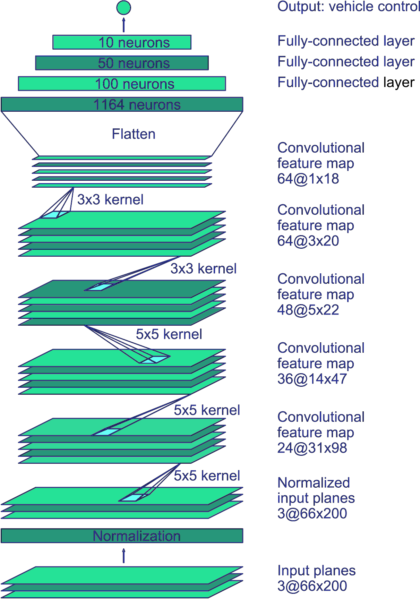
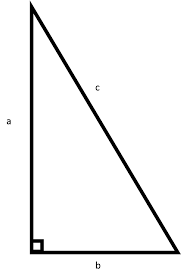

# **Behavioral Cloning** 


### Deep Learning Network for cloning driving behavior.

---

**Behavioral Cloning Project**

The goals / steps of this project are the following:

* Use the simulator to collect data of good driving behavior
* Build, a convolution neural network in Keras that predicts steering angles from images
* Train and validate the model with a training and validation set
* Test that the model successfully drives around track one without leaving the road
* Summarize the results with a written report

[//]: # (Image References)

[image1]: ./examples/placeholder.png "Model Visualization"
[image2]: ./examples/placeholder.png "Grayscaling"
[image3]: ./examples/placeholder_small.png "Recovery Image"
[image4]: ./examples/placeholder_small.png "Recovery Image"
[image5]: ./examples/placeholder_small.png "Recovery Image"
[image6]: ./examples/placeholder_small.png "Normal Image"
[image7]: ./examples/placeholder_small.png "Flipped Image"

## Rubric Points
### Here I will consider the [rubric points](https://review.udacity.com/#!/rubrics/432/view) individually and describe how I addressed each point in my implementation.  
---

### Files Submitted & Code Quality

#### 1. Submission includes all required files and can be used to run the simulator in autonomous mode

My project includes the following files:

* model.py containing the script to create and train the model
* drive.py for driving the car in autonomous mode
* model.h5 containing a trained convolution neural network 
* writeup_report.md summarizing the results

#### 2. Submission includes functional code

Using the Udacity provided simulator and my drive.py file, the car can be driven autonomously around the track by executing 

```sh
python drive.py model.h5
```


#### 3. Submission code is usable and readable

The model.py file contains the code for training and saving the convolution neural network. The file shows the pipeline I used for training and validating the model, and it contains comments to explain how the code works. 


### Model Architecture and Training Strategy

#### 1. An appropriate model architecture has been employed

My model consists of a convolution neural network with 5x5 and 3x3 kernel sizes and depths between 24 and 64. The complete network summary is shown below.

```sh
_________________________________________________________________
Layer (type)                 Output Shape              Param #
=================================================================
lambda_1 (Lambda)            (None, 160, 320, 3)       0
_________________________________________________________________
cropping2d_1 (Cropping2D)    (None, 75, 320, 3)        0
_________________________________________________________________
conv2d_1 (Conv2D)            (None, 36, 158, 24)       1824
_________________________________________________________________
leaky_re_lu_1 (LeakyReLU)    (None, 36, 158, 24)       0
_________________________________________________________________
conv2d_2 (Conv2D)            (None, 16, 77, 36)        21636
_________________________________________________________________
leaky_re_lu_2 (LeakyReLU)    (None, 16, 77, 36)        0
_________________________________________________________________
conv2d_3 (Conv2D)            (None, 6, 37, 48)         43248
_________________________________________________________________
leaky_re_lu_3 (LeakyReLU)    (None, 6, 37, 48)         0
_________________________________________________________________
dropout_1 (Dropout)          (None, 6, 37, 48)         0
_________________________________________________________________
conv2d_4 (Conv2D)            (None, 4, 35, 64)         27712
_________________________________________________________________
leaky_re_lu_4 (LeakyReLU)    (None, 4, 35, 64)         0
_________________________________________________________________
conv2d_5 (Conv2D)            (None, 2, 33, 64)         36928
_________________________________________________________________
leaky_re_lu_5 (LeakyReLU)    (None, 2, 33, 64)         0
_________________________________________________________________
dropout_2 (Dropout)          (None, 2, 33, 64)         0
_________________________________________________________________
flatten_1 (Flatten)          (None, 4224)              0
_________________________________________________________________
dropout_3 (Dropout)          (None, 4224)              0
_________________________________________________________________
dense_1 (Dense)              (None, 100)               422500
_________________________________________________________________
dense_2 (Dense)              (None, 50)                5050
_________________________________________________________________
dense_3 (Dense)              (None, 10)                510
_________________________________________________________________
dense_4 (Dense)              (None, 1)                 11
=================================================================
Total params: 559,419
Trainable params: 559,419
Non-trainable params: 0
_________________________________________________________________
```
The model includes Leaky RELU layers to introduce nonlinearity and to prevent neurons to die, and the data is normalized in the model using a Keras lambda layer (code line 95). 

#### 2. Attempts to reduce overfitting in the model

The model contains dropout layers in order to reduce overfitting (model.py lines 103,108, and 110). 

The model was trained and validated on different data sets to ensure that the model was not overfitting (code line  124-126). The model was tested by running it through the simulator and ensuring that the vehicle could stay on the track.

#### 3. Model parameter tuning

The model used an adam optimizer with an start learning rate of 1.0e-4, so the learning rate was not tuned manually (model.py line 144).


#### 4. Appropriate training data

Training data was chosen to keep the vehicle driving on the road. I used a combination of center lane driving, recovering from the left and right sides of the road with the correction factor of 0.2. Others corrections was tried using 0.15 and also 0.25, not changing making much difference on final result.

For details about how I created the training data, see the next section. 

### Model Architecture and Training Strategy

#### 1. Solution Design Approach

The overall strategy for deriving a model architecture was to start with a known network and improve until the results are satisfactory.

My first step was to use a convolution neural network model similar to the nvidia, as shown in the image below.  I thought this model might be appropriate because it was already designed for self driving car.

<center>
{:height="350px"}.
</center>

In order to gauge how well the model was working, I split my image and steering angle data into a training and validation set. I found that my first model had a low mean squared error on the training set but a high mean squared error on the validation set. This implied that the model was overfitting. 

To combat the overfitting, I modified the model adding dropout layers. I added three layers dropping half the connections.

Then I ... 

The final step was to run the simulator to see how well the car was driving around track one. There were a few spots where the vehicle fell off the track, mainly the steep curves, to improve the driving behavior in these cases, I added the left and right images with a correction factor of 0.2.

 If we thing in a rectangle triangle, to correction distance would be the smaller cathetus(b), the trajectory would be the hypotenuse(c) and clsing the triangle would give us the other cathetus (a). To find the angle opposing the cathetus b, we use the formula => sin(θ) = Opposite / Hypotenuse. By doing these and considering the car should move 1 meter (b) in 10 meters(a), would give us an angle of ~6º. Dividing it by 25 to normalize would give 0.24. But between 0.15 and 0.25 does not affect the result.
 
 <center>
  
</center>


At the end of the process, the vehicle is able to drive autonomously around the track without leaving the road.

#### 2. Final Model Architecture

The final model architecture (model.py lines 94-114) consisted of a convolution neural network with the following layers and layer sizes.


```sh
_________________________________________________________________
Layer (type)                 Output Shape              Param #
=================================================================
lambda_1 (Lambda)            (None, 160, 320, 3)       0
_________________________________________________________________
cropping2d_1 (Cropping2D)    (None, 75, 320, 3)        0
_________________________________________________________________
conv2d_1 (Conv2D)            (None, 36, 158, 24)       1824
_________________________________________________________________
leaky_re_lu_1 (LeakyReLU)    (None, 36, 158, 24)       0
_________________________________________________________________
conv2d_2 (Conv2D)            (None, 16, 77, 36)        21636
_________________________________________________________________
leaky_re_lu_2 (LeakyReLU)    (None, 16, 77, 36)        0
_________________________________________________________________
conv2d_3 (Conv2D)            (None, 6, 37, 48)         43248
_________________________________________________________________
leaky_re_lu_3 (LeakyReLU)    (None, 6, 37, 48)         0
_________________________________________________________________
dropout_1 (Dropout)          (None, 6, 37, 48)         0
_________________________________________________________________
conv2d_4 (Conv2D)            (None, 4, 35, 64)         27712
_________________________________________________________________
leaky_re_lu_4 (LeakyReLU)    (None, 4, 35, 64)         0
_________________________________________________________________
conv2d_5 (Conv2D)            (None, 2, 33, 64)         36928
_________________________________________________________________
leaky_re_lu_5 (LeakyReLU)    (None, 2, 33, 64)         0
_________________________________________________________________
dropout_2 (Dropout)          (None, 2, 33, 64)         0
_________________________________________________________________
flatten_1 (Flatten)          (None, 4224)              0
_________________________________________________________________
dropout_3 (Dropout)          (None, 4224)              0
_________________________________________________________________
dense_1 (Dense)              (None, 100)               422500
_________________________________________________________________
dense_2 (Dense)              (None, 50)                5050
_________________________________________________________________
dense_3 (Dense)              (None, 10)                510
_________________________________________________________________
dense_4 (Dense)              (None, 1)                 11
=================================================================
Total params: 559,419
Trainable params: 559,419
Non-trainable params: 0
_________________________________________________________________
```

Here is a visualization of the architecture.

 


#### 3. Creation of the Training Set & Training Process

To capture good driving behavior, I first recorded two laps on track one using center lane driving. Here is an example image of center lane driving:

 

I then recorded the vehicle recovering from the left side and right sides of the road back to center so that the vehicle would learn to correct its trajectory. These images show a left and a right image, with this images a correction of +0.2 is applied to left images and -0.2 to the right images:

  

I used data 3 laps on track one e one lap on track two in order to get more data points.

To augment the data sat, I also flipped images to get more images, one of the reasons was to have more images turning right. For example, here is an image that has then been flipped:

  

After the collection process, I had 25094 number of data points. I then preprocessed this data by converting it from BGR to RGB. Opencv uses BGR natively, but the image from the drive.py is RGB. 

Another preprocessing that I did was to augment by darkening some of the images randomly. When driving on track02 the car was acting weirdly on shaded area and this preprocessing solved the problem. Sample images is seen below.

  

I finally randomly shuffled the data set and put 20% of the data into a validation set. 

I used this training data for training the model. The validation set helped determine if the model was over or under fitting. The ideal number of epochs was 16. I used an adam optimizer so that manually training the learning rate wasn't necessary.
